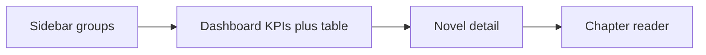

# Dashboard layout + bảng truyện hẹp

## Hiện trạng (vấn đề)

- `[MainLayout.tsx](frontend/src/layouts/MainLayout.tsx)`: header sticky + `maxWidth: 1100` căn giữa → hai bên trống, nội dung phải kéo dài xuống.
- `[NovelListPage.tsx](frontend/src/features/novels/pages/NovelListPage.tsx)`: card 2 cột + summary 3 dòng + 2 progress bar → mỗi truyện chiếm nhiều chiều cao.
- App mới có ít route (`/`, detail, reader) nên sidebar cần nhóm gọn, không nhồi menu giả.

## Hướng UX đã chọn

1. **Bỏ header**, chuyển brand + nav vào **sidebar** (Ant Design `Layout.Sider` + `Menu` có `items` group).
2. **Trang chủ = Dashboard**: 1 hàng KPI nhỏ (aggregate từ `GET /novels` sẵn có) + **bảng truyện hẹp** bên dưới — không tách `/novels` riêng lúc này.
3. **Bảng thay card**: `Table size="small"`, cột gọn, click row → detail; không hiện summary dài trên list.
4. **Full-bleed content**: bỏ `maxWidth: 1100`, padding nhỏ hơn (`16px`), content chiếm gần hết viewport.
5. **Sidebar groups tối thiểu** (đủ dùng, dễ mở rộng sau):
  - **Tổng quan**: Dashboard (`/`)
  - **Thư viện**: Truyện (cùng `/` — highlight cả hai hoặc chỉ Dashboard; menu “Truyện” scroll/focus vào bảng, hoặc alias `/#novels`)
  - **Hệ thống**: HealthBadge ở footer sider (không cần trang riêng)

Quyết định cụ thể: menu chỉ 1 item chính **Dashboard** trong Tổng quan; nhóm Thư viện có **Danh sách truyện** trỏ `/` (active khi path là `/`); Hệ thống không có link chết — chỉ hiện trạng thái API dưới đáy sider.

## Đề xuất UX đi kèm (sẽ làm trong cùng đợt)

| Ý                                                                                                | Lý do                                                        |
| ------------------------------------------------------------------------------------------------ | ------------------------------------------------------------ |
| Hàng KPI 4 ô: Tổng truyện, Tổng chương, Crawl %, TTS %                                           | Cho cảm giác dashboard thật, vẫn 1 API                       |
| Cột bảng: Title, Author, Chapters, Crawl, TTS, Failed                                            | Hẹp, so sánh nhanh; progress dạng `%` hoặc `Progress` 1 dòng |
| `size="small"` + `pagination` nếu > 20                                                           | Giữ viewport ngắn                                            |
| Search title/author phía trên bảng                                                               | Dùng chiều ngang thay filter dọc                             |
| Sider collapsible (`collapsedWidth=64`)                                                          | Màn hẹp vẫn ổn                                               |
| Detail/reader: giữ layout trong cùng shell; breadcrumb gọn, giảm `Title level={2}` → `level={4}` | Đưa mục lục lên cao hơn                                      |

Không làm trong đợt này: trang Jobs/TTS riêng, dark theme, redesign reader typography.

## Thay đổi file chính

1. `**[frontend/src/layouts/MainLayout.tsx](frontend/src/layouts/MainLayout.tsx)**`
  - `Sider` + `Menu` groups + brand ở top sider.  
  - `HealthBadge` xuống footer sider.  
  - `Content` full width, padding nhỏ; bỏ header.
2. **Đổi `[NovelListPage.tsx](frontend/src/features/novels/pages/NovelListPage.tsx)` → Dashboard**
  - Rename/reuse thành `DashboardPage` (hoặc giữ file, đổi nội dung).  
  - Aggregate stats client-side từ list.  
  - KPI `Statistic`/`Card` hàng ngang nhỏ.  
  - `Table` mật độ cao thay `Row`/`Card`.  
  - Optional: `Input.Search` filter local.
3. `**[App.tsx](frontend/src/app/App.tsx)**`
  - Route `/` → Dashboard; giữ redirect `/dashboard` → `/` nếu muốn alias.
4. `**[NovelDetailPage.tsx](frontend/src/features/novels/pages/NovelDetailPage.tsx)**` (nhẹ)
  - Breadcrumb “Dashboard” thay “Truyện”.  
  - Thu gọn header card (title nhỏ hơn, summary collapse/`ellipsis`) để bảng chương lên sớm hơn.
5. **CSS** `[app.css](frontend/src/app/app.css)` nếu cần class densify sider/content (tối thiểu).

## Không đụng backend

Aggregate từ `NovelListItem.stats` đủ cho KPI; không API mới.